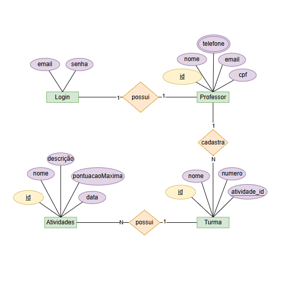
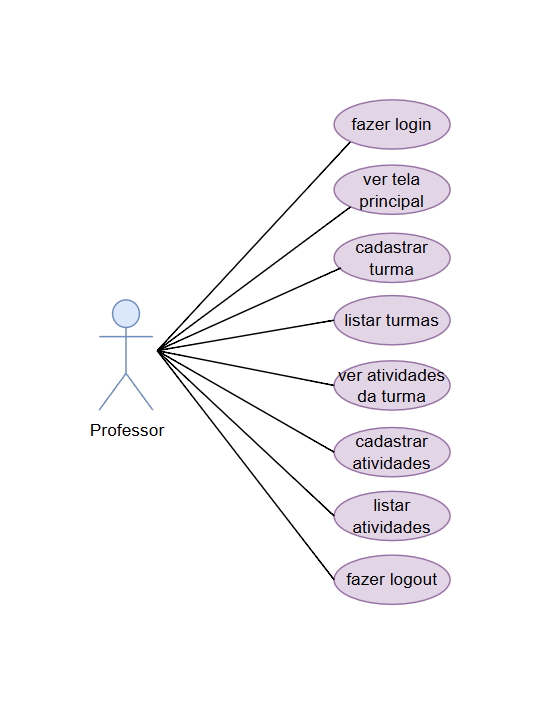

# Sistema de Gerenciamento de Turmas e Atividades


Este projeto é um sistema de gerenciamento para professores, permitindo o cadastro e a gestão de turmas e atividades.

## 1. Requisitos de Infraestrutura

Para a correta execução do sistema, os seguintes requisitos de infraestrutura são necessários:

| Componente | Requisito | Detalhes |
| :--- | :--- | :--- |
| **SGBD** | MySQL | O sistema utiliza o MySQL como banco de dados.
| **Linguagem de Programação** | Node.js | A aplicação backend é desenvolvida em JavaScript, utilizando o ambiente de execução Node.js. |
| **Servidor de Aplicação** | Express.js | O servidor de aplicação é construído com o framework **Express.js**, rodando sobre o Node.js. |
| **Sistema Operacional** | Multiplataforma | O sistema pode ser executado em qualquer sistema operacional que suporte Node.js e MySQL |
| **ORM/Cliente DB** | Prisma | O sistema utiliza o **Prisma** como ORM, com o cliente `prisma-client-js`. |

## 2. Configuração do Banco de Dados

O sistema utiliza a variável de ambiente `DATABASE_URL` para se conectar ao banco de dados.

Crie um arquivo `.env` na raiz do projeto com o seguinte conteúdo:

```env
DATABASE_URL="mysql://root@localhost:3306/escolaavaliacao?schema=public&timezone=UTC"
```

## 3. Tutorial de Como Testar o Aplicativo

#### Para testar o sistema, siga os passos abaixo:

### 3.1. Instalação das Dependências

Assumindo que você está no diretório raiz do projeto, execute o comando para instalar as dependências.

```bash
npm init -y
npm i cors express dotenv
```

### 3.2. Configuração do Banco de Dados

1.  Crie o banco de dados `escolaavaliacao` no seu servidor MySQL.
2.  Execute as migrações do Prisma para criar as tabelas necessárias (Login, Professor, Turma, Atividade) com base no `schema.prisma`:

```bash
npm i prisma -g
npx prisma init --datasource-provider mysql
```
3. Para criar as tabelas no banco de dados, execute o comando abaixo e se precisar resetar execute o outro.

```bash
npx prisma migrate dev --name init
npx prisma migrate reset
```

### 3.3. Inicialização do Servidor

Inicie o servidor de aplicação Node.js:

```bash
npx nodemon
```

### 3.4. Teste da Aplicação (Frontend)

O sistema possui arquivos de frontend (`login.html`, `principal.html`, `atividades.html`).

1.  Abra o arquivo `login.html` em seu navegador web.
2.  O frontend fará requisições para o backend rodando em `http://localhost:3000`.
3.  **Crie um Professor (Usuário):** Como o sistema não possui uma rota de cadastro de professor no frontend, você deve usar uma ferramenta como **Insomnia** para criar um professor inicial, que também criará as credenciais de login:

    **Método:** `POST`
    **URL:** `http://localhost:3000/professores`
    **Body (JSON):**
    ```json
    {
      "nome": "Professor Teste",
      "email": "teste@escola.com",
      "cpf": "12345678900",
      "telefone": "999999999",
      "senha": "senha123"
    }
    ```

4.  **Faça Login:** No `login.html`, use o `email` (`teste@escola.com`) e a `senha` (`senha123`) cadastrados.
5.  Após o login, você será redirecionado para a tela principal (`principal.html`), onde poderá gerenciar turmas e atividades.

---

## 4. Diagramas e Prints do Projeto

### Diagramas

*   **Diagrama Entidade-Relacionamento (DER):**
    
*   **Diagrama de Casos de Uso (UML):**
    

### Prints 

* **Tela de Login**

* **Tela Principal**

* **Tela de Atividades**

* **Botão de Excluir**

